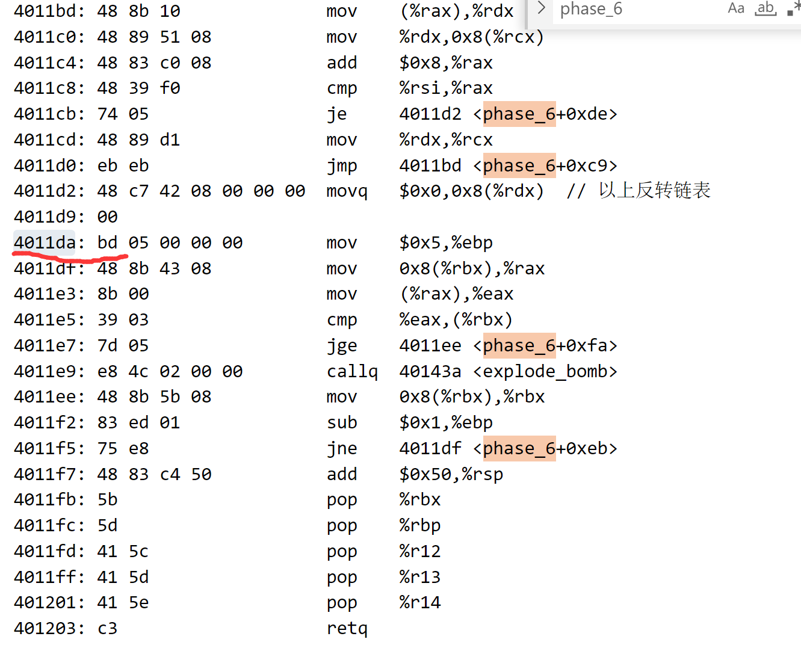
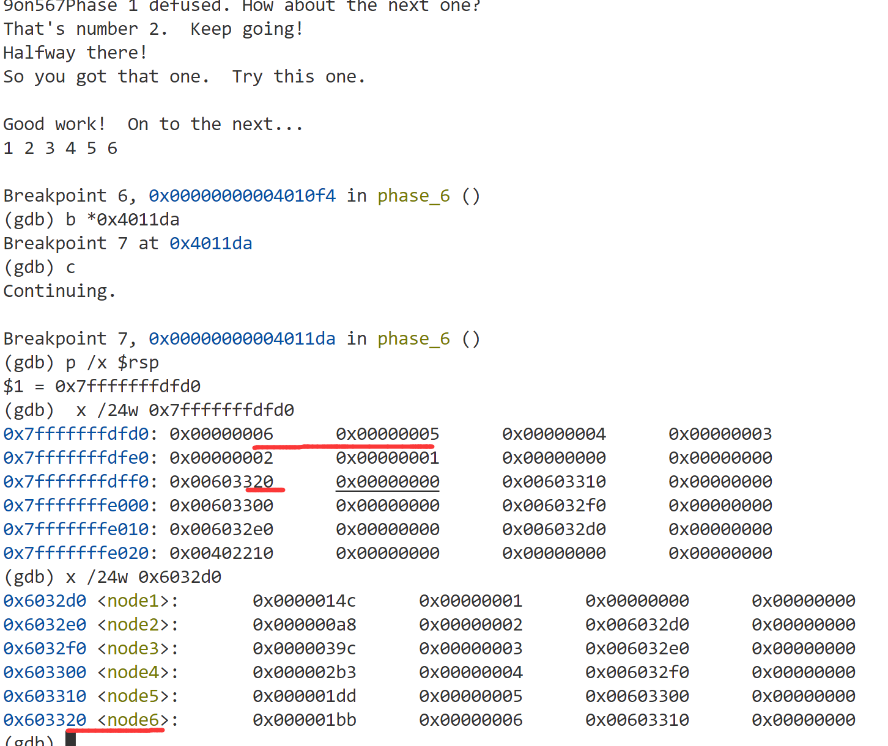
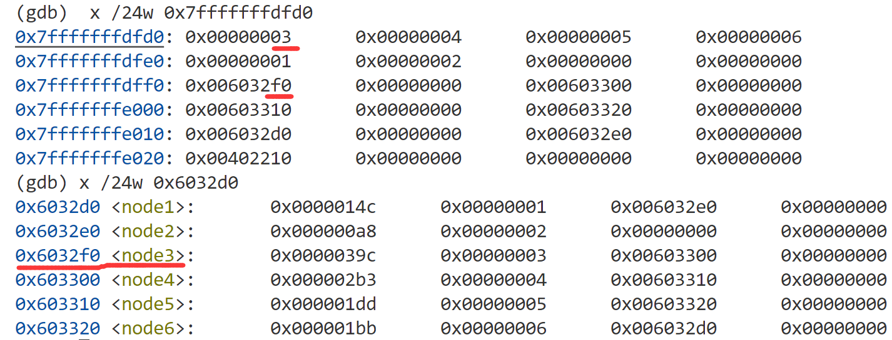

## phase_6

发现规律 首先前面一大堆 就是证明输入了 6个 <= 6的值 而且还不相等，然后做了一个反转链表的操作（还是啥），但这个不重要，只需要跳到 0x4011da 处，因为在debug过程中会发现这里之后的代码才是真正会引发bomb的地方

然后在这里打印栈里面的值 和 一个存放node节点地址的值，可以发现，如果我们输入1 2 3 4 5 6，栈里面的值变成了 7 - x，即6 5 4 3 2 1，并且很妙的这些数字对应node节点 6 - node6 - 0x603320 , 而在后面会按照6 5 4 3 2 1的顺序比较node 里面前4个字节的大小，从大到小排序

e.g. 6 - 0x1bb 5 - 0x1dd，所以只要我们输入的值被7减去后，对应的node的值按从大到小排序就会通关！

所以很明显看出 node 按照 node 3 - 4 - 5 - 6 - 1 - 2 的顺序从大到小，所以我们只需要输入4 3 2 1 6 5即可

